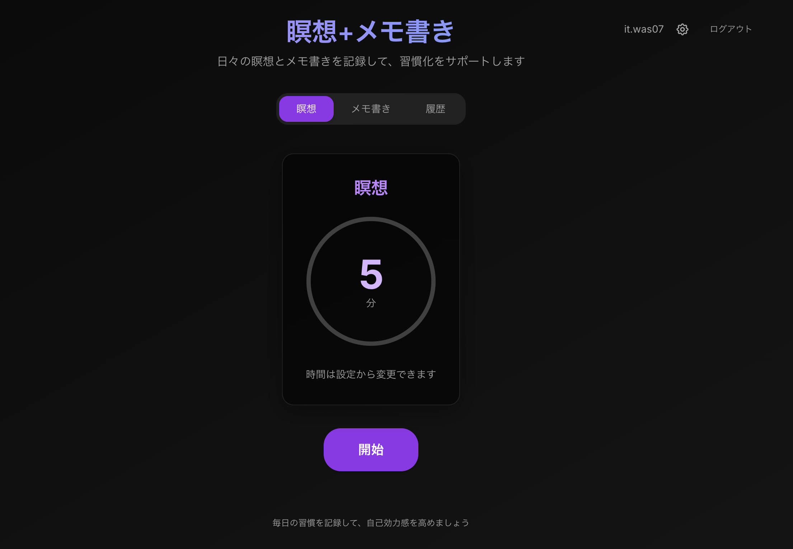
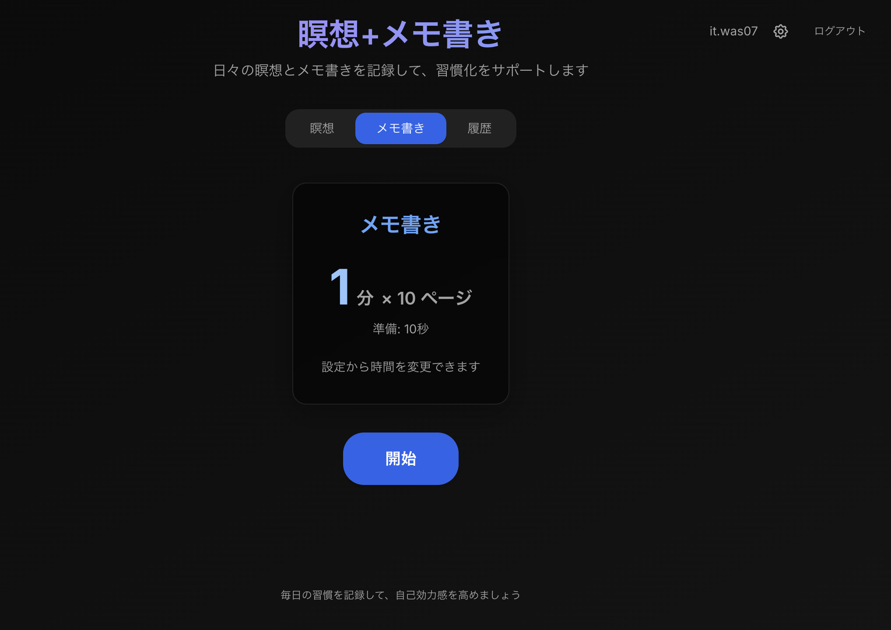

# Meditation & Journaling


**マインドフルネスを習慣化するための瞑想・メモ書きタイマーアプリ**

本アプリは、瞑想とメモ書き（ジャーナリング）の実践を支援し、継続的な習慣化を促すWebアプリケーションです。タイマー機能、セッション記録、統計の可視化により、ユーザーのメンタルヘルスとセルフケアをサポートします。

**🔗 デモサイト**: [https://meditation-and-journaling.vercel.app](https://meditation-and-journaling.vercel.app)

### 🎯 デモアカウント

以下のアカウントですぐにお試しいただけます：

- **メールアドレス**: `demo@example.com`
- **パスワード**: `Demo1234!`

> ⚠️ **注意**: このアカウントは公開されています。個人情報や機密情報は入力しないでください。

<p align="center">
  
  
</p>
<p align="center">
  <em>瞑想タイマー（左）とメモ書きタイマー（右）</em>
</p>

---

## 目次

- [プロジェクトの特徴](#-プロジェクトの特徴)
- [技術スタック](#️-技術スタック)
- [アーキテクチャ](#️-アーキテクチャ)
- [主な機能](#-主な機能)
- [クイックスタート](#-クイックスタート)
- [プロジェクト構成](#-プロジェクト構成)
- [開発プロセス](#-開発プロセス)
- [Gitブランチ戦略](#-git-ブランチ戦略)
- [実装のハイライト](#-実装のハイライト)
- [今後の展望](#-今後の展望)
- [開発者](#-開発者)

---

## 📌 プロジェクトの特徴

### 技術的なハイライト

- **モダンなフルスタック構成**: Next.js 15（App Router）+ TypeScript + PostgreSQL
- **型安全性の徹底**: TypeScript strict モード、Zod による実行時バリデーション、Drizzle ORM
- **セキュリティファースト**: bcryptjs によるパスワードハッシュ化、JWT セッション、Rate Limiting（Upstash Redis）
- **Edge Runtime 対応**: Vercel Edge での高速レスポンス、動的インポートによる最適化
- **テスト駆動開発（TDD）**: Jest + React Testing Library、継続的なテストカバレッジ向上
- **CI/CD パイプライン**: GitHub Actions による自動テスト・デプロイ、コスト管理の徹底

### 設計思想

1. **ユーザー体験の最適化**
   - Tailwind CSS によるレスポンシブデザイン
   - Framer Motion による滑らかなアニメーション
   - 直感的なタイマー操作（一時停止・再開・設定変更）

2. **セキュリティ・パフォーマンス**
   - 認証エンドポイントへの Rate Limiting（ブルートフォース攻撃防止）
   - Edge Runtime での軽量動作（動的インポートによる最適化）
   - セキュリティヘッダーの設定（CSP, XSS保護等）

3. **開発体験の向上**
   - TDD サイクル（Red → Green → Refactor）の徹底
   - Git ブランチ戦略（feature → develop → main）
   - Claude Code による自動化（コミット提案、型チェック、シークレット検出）

---

## 🏗️ アーキテクチャ

```
┌─────────────────────────────────────────────────────────┐
│                      ブラウザ                             │
│                                                         │
│   ┌──────────────┐  ┌───────────────┐  ┌─────────────┐  │
│   │  瞑想タイマー  │  │  メモ書きタイマー  │  │  履歴・統計  │  │
│   └──────┬───────┘  └───────┬───────┘  └──────┬──────┘  │
│          └──────────────────┼──────────────────┘         │
│                             ▼                            │
│                    ┌────────────────┐                    │
│                    │  LocalStorage  │ ← セッション管理    │
│                    └────────────────┘                    │
└─────────────────────┬───────────────────────────────────┘
                      │ HTTPS
                      ▼
┌─────────────────────────────────────────────────────────┐
│              Next.js 15 (Vercel Edge Runtime)            │
│                                                         │
│   ┌──────────────────┐   ┌─────────────────────────┐    │
│   │  middleware.ts   │   │      API Routes          │    │
│   │  ・認証チェック   │   │  /api/auth/signup       │    │
│   │  ・Rate Limiting │   │  /api/auth/[...nextauth]│    │
│   │  ・動的インポート │   └───────────┬─────────────┘    │
│   └──────────────────┘               ▼                  │
│                          ┌─────────────────────┐         │
│                          │   NextAuth.js v5    │         │
│                          │ ・JWT Session       │         │
│                          │ ・Credentials Auth  │         │
│                          └──────────┬──────────┘         │
└─────────────────────────────────────┼────────────────────┘
                                      │ 動的インポート
                                      ▼
                          ┌─────────────────────┐
                          │   Supabase          │
                          │   PostgreSQL        │
                          │   (Drizzle ORM)     │
                          └─────────────────────┘
```

### アーキテクチャ上の工夫

- **Edge Runtime 対応**: `postgres-js` は Edge Runtime で動作しないため、認証フロー内で動的インポート（`await import()`）を使用し、ミドルウェアの軽量性を保持
- **Rate Limiting の柔軟性**: 本番環境では Upstash Redis、開発環境ではメモリベースに自動切り替え
- **型安全性の徹底**: Drizzle ORM によるスキーマ定義、Zod による実行時バリデーション、TypeScript strict モード

---

## 🛠️ 技術スタック

### フロントエンド

| 技術                        | 選定理由                                                                   |
| --------------------------- | -------------------------------------------------------------------------- |
| **Next.js 15 (App Router)** | React Server Components によるパフォーマンス最適化、Edge Runtime 対応      |
| **TypeScript**              | 型安全性の確保、開発体験の向上、リファクタリングの安全性                   |
| **Tailwind CSS**            | ユーティリティファーストによる高速開発、インラインクラスのみで一貫性を保持 |
| **Framer Motion**           | 宣言的なアニメーション、React との統合性                                   |

### バックエンド・インフラ

| 技術                    | 選定理由                                           |
| ----------------------- | -------------------------------------------------- |
| **NextAuth.js v5**      | 認証フローの標準化、JWT セッション管理、型安全性   |
| **Supabase PostgreSQL** | マネージドDB、スケーラビリティ、無料枠での運用     |
| **Drizzle ORM**         | 型安全なクエリビルダー、軽量、マイグレーション管理 |
| **Upstash Redis**       | Edge Runtime 対応の Rate Limiting、グローバル分散  |
| **Zod**                 | 実行時バリデーション、TypeScript との統合          |
| **bcryptjs**            | 業界標準のパスワードハッシュ化                     |

### 開発・テスト・デプロイ

| 技術                             | 選定理由                                                           |
| -------------------------------- | ------------------------------------------------------------------ |
| **Jest + React Testing Library** | コンポーネントテスト、スナップショットテスト、カバレッジ計測       |
| **Playwright**                  | E2Eテスト、クリティカルなユーザーフローの自動テスト                  |
| **GitHub Actions**               | CI/CD パイプライン、自動テスト・デプロイ                           |
| **Vercel**                       | Next.js に最適化されたホスティング、Edge Functions、自動プレビュー |
| **Claude Code**                  | AI支援開発、TDD サイクル自動化、コード品質管理                     |

---

## 🚀 クイックスタート

```bash
# 1. リポジトリのクローン
git clone https://github.com/iwasatat0107/MeditationAndJournaling.git
cd MeditationAndJournaling

# 2. 依存関係のインストール
npm install

# 3. 環境変数の設定
cp .env.example .env.local
# .env.local を編集して以下を設定:
# - DATABASE_URL（Supabase PostgreSQL）
# - NEXTAUTH_URL（http://localhost:3000）
# - NEXTAUTH_SECRET（任意の文字列）

# 4. データベースのマイグレーション
npm run db:migrate

# 5. 開発サーバーの起動
npm run dev
```

ブラウザで `http://localhost:3000` を開きます。

### 主要コマンド

| コマンド                | 説明                 |
| ----------------------- | -------------------- |
| `npm run dev`           | 開発サーバー起動     |
| `npm test`              | ユニットテスト実行   |
| `npm run test:coverage` | カバレッジ確認       |
| `npm run test:e2e`      | E2Eテスト実行        |
| `npm run test:e2e:ui`   | E2EテストをUI付きで実行（デバッグ用） |
| `npm run build`         | プロダクションビルド |

---

## 📂 プロジェクト構成

```
.
├── app/                        # Next.js ページ・API
│   ├── page.tsx                # ホーム（タイマー・履歴）
│   ├── api/auth/               # 認証API
│   └── login/, signup/         # 認証ページ
├── components/                 # UIコンポーネント
│   ├── MeditationTimer.tsx     # 瞑想タイマー
│   ├── JournalingTimer.tsx     # メモ書きタイマー
│   └── __tests__/              # コンポーネントテスト
├── lib/                        # ユーティリティ
│   ├── auth/                   # 認証（バリデーション・ハッシュ化）
│   ├── db/                     # Drizzle ORM
│   └── storage.ts              # LocalStorage 管理
├── auth.ts                     # NextAuth.js 設定
└── middleware.ts               # 認証ミドルウェア
```

---

## ✨ 主な機能

### 1. 認証・セキュリティ

**ユーザー視点**:

- メールアドレス + パスワードでアカウント作成・ログイン
- セキュアなセッション管理（自動ログアウト対応）

**エンジニア視点**:

- NextAuth.js v5 による JWT セッション管理
- bcryptjs によるパスワードハッシュ化（平文保存禁止）
- Zod スキーマによる入力バリデーション（サーバー・クライアント共用）
- Rate Limiting によるブルートフォース攻撃防止（10req/min）

---

### 2. 瞑想タイマー（紫テーマ）


**ユーザー視点**:

- ワンタップで開始、集中を妨げないシンプルなUI
- 一時停止・再開が可能
- 完了時に音でお知らせ

**エンジニア視点**:

- デフォルト 5 分（設定で 2, 5, 7, 10, 15 分へ変更可能）
- 円形プログレスバーによる視覚的フィードバック（Framer Motion）
- セッション完了時のみ記録保存（途中停止時は保存しない）

---

### 3. メモ書きタイマー（青テーマ）


**ユーザー視点**:

- ページ単位で書き進める仕組み（最大10ページ）
- 各ページ後に休憩時間を自動挿入
- 終了 5 秒前からカウントダウン音でアラート

**エンジニア視点**:

- 1ページあたりの時間: 1分, 2分, 5分, 7分, 10分（設定で変更可能）
- 休憩時間: 5秒, 10秒, 15秒（設定で変更可能）
- 最終ページ（10ページ目）後は休憩なしで完了

**フロー図**:

```
開始 → 書き込み(N分) → 休憩(10秒) → 次ページ → ... → 完了(10ページ目)
```

---

### 4. 履歴・統計

**ユーザー視点**:

- 連続記録日数（ストリーク）の可視化
- 瞑想・メモ書きの累計回数と合計時間
- セッション一覧の閲覧・削除

**エンジニア視点**:

- LocalStorage によるセッション管理（将来的に PostgreSQL へ移行予定）
- 日次統計の自動集計

---

## 🤖 開発プロセス

### テスト駆動開発（TDD）の徹底

本プロジェクトでは **Red → Green → Refactor** サイクルを厳格に適用しています。

1. **Red**: 失敗するテストを先に書く
2. **Green**: 最小限の実装でテストを通す
3. **Refactor**: テストが通った後にコードを整理

### AI 支援開発（Claude Code）

- `/tdd` スキル: TDD サイクルを自動実行
- 自動コード品質チェック:
  - TypeScript 型エラー検出
  - シークレット・機密情報の検出
  - console.log 残しの検出
  - main ブランチへの直接コミット防止

### CI/CD パイプライン

- **GitHub Actions**: プルリクエストごとに自動テスト・ビルド
- **Vercel**: プレビューデプロイ、本番デプロイの自動化
- **コスト管理**: GitHub Actions の無料枠（2,000分/月）内で運用中

---

## 🔀 Git ブランチ戦略

```
main (本番環境)
  ↑
  │ PR
  │
develop (開発環境)
  ↑
  │ PR
  │
feature/issue-X-... (機能開発)
```

- **main**: 本番環境用（安定版のみ）
- **develop**: 開発用メインブランチ
- **feature/**: 機能開発・バグ修正用（Issue ごとに作成）

**ワークフロー**:

1. GitHub Issue 作成
2. `feature/issue-X-...` ブランチ作成
3. TDD サイクルで実装
4. PR → `develop` へマージ
5. リリース時に `develop` → `main` へ PR

---

## 💡 実装のハイライト

### 1. Edge Runtime での動的インポート最適化

**課題**: `postgres-js` は Edge Runtime で動作しない

**解決策**: 認証フロー内で動的インポート（`await import('./lib/db')`）を使用し、ミドルウェアの軽量性を保持

```typescript
// auth.ts
authorize: async (credentials) => {
  // 動的インポートでEdge Runtimeでの動作を保証
  const { db } = await import("./lib/db");
  const { users } = await import("./lib/db/schema");
  // ...
};
```

### 2. Rate Limiting の環境別自動切り替え

**課題**: 開発環境でRedisを立てるのはコストが高い

**解決策**: 環境変数の有無で自動的にメモリベース/Redisベースを切り替え

```typescript
// middleware.ts
const limiter = process.env.UPSTASH_REDIS_REST_URL
  ? new Ratelimit({
      /* Upstash Redis */
    })
  : new Ratelimit({
      /* メモリベース */
    });
```

### 3. 型安全性の徹底

- **Drizzle ORM**: スキーマからTypeScript型を自動生成
- **Zod**: 実行時バリデーション + 型推論
- **NextAuth.js 型拡張**: `next-auth.d.ts` で JWT の型を拡張

```typescript
// types/next-auth.d.ts
declare module "next-auth/jwt" {
  interface JWT {
    id: string;
    email: string;
  }
}
```

### 4. TDD による堅牢性

- コンポーネントテスト: 20件以上
- ユーザー操作のシミュレーション（タイマー開始・停止・設定変更）
- エッジケースのカバー（ログイン失敗、バリデーションエラー等）

---

## 🔮 今後の展望

- [x] **E2Eテスト（Playwright）の導入**: ユーザーフロー全体のテスト自動化 ✅
- [x] **PostgreSQL への完全移行**: LocalStorage からの脱却、複数デバイス対応 ✅
- [ ] **プッシュ通知**: タイマー完了時の通知機能
- [ ] **データエクスポート**: CSV/JSON 形式でのデータダウンロード
- [ ] **多言語対応の拡張**: 英語・日本語以外の言語サポート
- [ ] **ダークモード**: ユーザー設定による切り替え

---

## 📝 ライセンス

MIT

---

## 👤 開発

本プロジェクトは、フルスタック・テスト駆動・CI/CD パイプライン構築して開発しました。

**技術**:

- Next.js / React / TypeScript によるフロントエンド開発
- NextAuth.js / PostgreSQL / Drizzle ORM によるバックエンド開発
- Jest / React Testing Library による自動テスト
- GitHub Actions / Vercel による CI/CD パイプライン
- TDD（テスト駆動開発）の実践
- セキュリティ・パフォーマンスへの配慮

**GitHub**: [@iwasatat0107](https://github.com/iwasatat0107)
